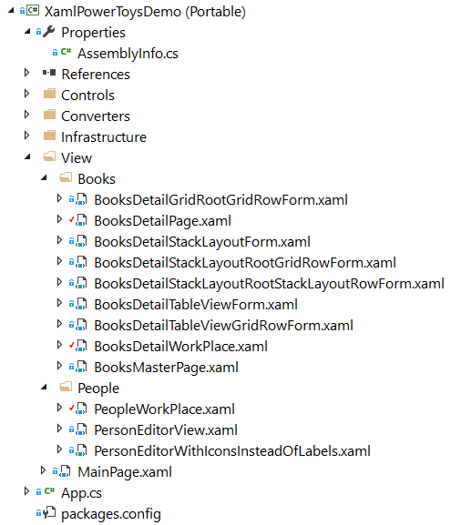
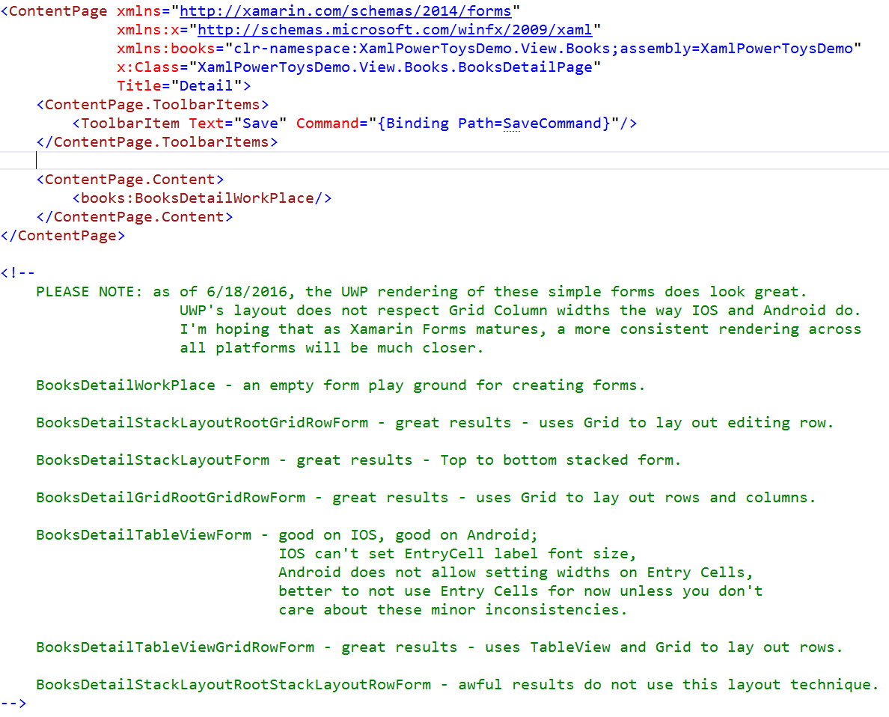

# XAML Power Toys Demo

This is the solution that I used to record the XAML Power Toys videos.
  
## Purpose

The purpose of this repro is to provide an application for testing the XAML Power Toys Extension.

This is a Xamarin Forms IOS, Android, UWP application that also has a WPF project.

A secondary purpose is to compare the cross-platform rendering of a data entry form.  

I strongly recommend that you leverage this research and run each of the forms in all three platforms: IOS, Android, and UWP.  This will give you an idea of how Xamarin Forms renders and which layout strategy works best for you application requirements.

## Portable Project

The XamlPowerToysDemo (Portable) Project has most of the code and forms you'll be using.

The below images show the folder structure of the project.

### Books 

The BooksDetailPage.xaml is the file that is used to determine which Books Detail form will be rendered when the application starts.

To change which Books Detail form is used, change the ContentPage.Content to reflect the desired Detail form.

All of the forms will use the BooksDetailPageViewModel.

The green comments lists all of the Detail forms.

The BooksDetailWorkPlace form is an empty form for testing out XAML Power Toys.

### People

The PeopleWorkPlace form is an empty form for testing out XAML Power Toys.

## License
[Apache 2.0](LICENSE)